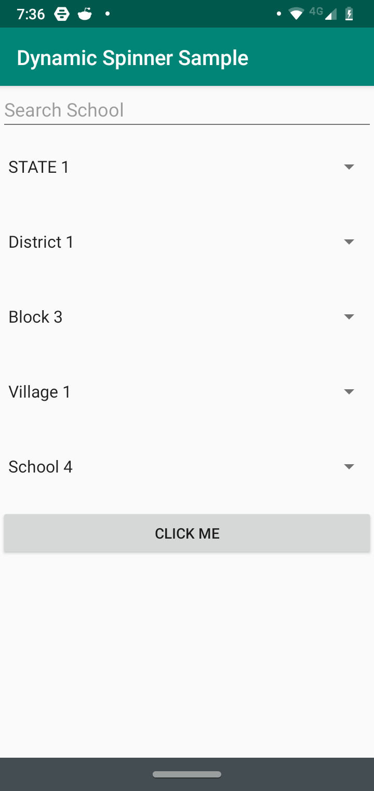

*   [Overview](#Overview)
*   [Import](#Import)
*   [Usage](#Usage)
*   [Internal Working](#Internal-Working)
### Overview

An Android UI library which allows developers to create a cascading
dropdown. The multiple spinners are populated with data from a JSON file
provided in the **module-name/src/main/assets** folder. Check the
[sample APK](app-debug.apk) to see library in usage corresponding to the
JSON file [sample.json](app/src/main/assets/sample.json).

<p align="center">
<kbd>

</kbd>
</p>


### Import

* Clone or Download The project [Dynamic Spinner Sample](
                                https://github.com/Samagra-Development/cascading-dropdown)
                                
* Open your project in Android Studio and import the dynamicspinner
  module into your project. Goto **File-> New-> Import Module**.
  Navigate to where dynamicspinner module is located on the disk and
  select dynamicspinner directory.

* Once import is complete goto the build.gradle of the module in which
  you want to use [**DynamicSpinnerView**](/dynamicspinner/src/main/java/com/sample/tanay/dynamicspinner/DynamicSpinnerView.java)
  
  and add the line 
  
  ` implementation project(path: ':dynamicspinner') `
  
* Do a Gradle sync. You should be able to use the class
  [**DynamicSpinnerView**](/dynamicspinner/src/main/java/com/sample/tanay/dynamicspinner/DynamicSpinnerView.java)
  in your module.


  
### Usage

* Call the static method **setup** in the class
  [**DynamicSpinnerView**](/dynamicspinner/src/main/java/com/sample/tanay/dynamicspinner/DynamicSpinnerView.java).
  The setup method checks if the file has already been read and the
  information associated with it has been saved in an SQLite Database.
  If the information has not been saved then the process to save the
  information is started. For more information See class
  [**DataProcessor**](/dynamicspinner/src/main/java/com/sample/tanay/dynamicspinner/DataProcessor.java)
  
  ```
  DynamicSpinnerView.setup(this /* application context required to read from assets*/,
                "sample.json" /* full name of the JSON file in the assets folder*/,
                new DynamicSpinnerView.SetupListener() {
                    @Override
                    public void onSetupComplete() {
                        // called when the setup process has been completed
                        // if the setup process is not required to run as the infomration
                        // has already been saved then 
                    }

                    @Override
                    public void onSetupProcessStart() {
                    
                    // called when the setup process has

                    }
                } /* an instance of the listener which will be called during the setup process*/,
                2 /*the version code in integer, if you want to use a different file as data
                 data source from the old file then the version code needs to be incremented*/);

  ```


* The setup process may take time some time to finish (for a 50 MB JSON
  file it takes almost 45 seconds) and you may not want the user to
  wait. 
  
  In this case the **DynamicSpinnerView.SetupListener** instance may get
  garbage collected and you will not be notified when the setup process
  is complete. 
  
  The module sends **Broadcasts** using **LocalBroadcastManager** to
  solve the above problem. 
  
  The following broadcasts are sent: 
  1.    ```org.samagra.SETUP_COMPLETE``` called when the setup process
        has been completed. This value can be accessed via
        ```DynamicSpinnerView.SETUP_COMPLETE```
       
     
  2.    ```org.samagra.SETUP_FAIL``` called when the setup process has
        failed due to any reason. This value can be accessed via
        ```DynamicSpinnerView.SETUP_FAIL```
       
     
  3.    ```org.samagra.SETUP_START``` called when the setup process has
        been started. This value can be accessed via
        ```DynamicSpinnerView.SETUP_START```
       
       
       
  

* Add the **DynaminSpinnerView** in the corresponding layout.xml file

    ```
    <com.sample.tanay.dynamicspinner.DynamicSpinnerView
    android:id="@+id/dynamicSpinnerView" 
    android:layout_width="match_parent"
    android:layout_height="wrap_content"
    app:layout_constraintStart_toStartOf="parent"          
    app:layout_constraintTop_toTopOf="parent" /> 
    ```


   **Note**: Since the height of the **DynamicSpinnerView** can be vary
   it is advisable to place it inside a ScrollView or a nested
   ScrollView

* Set the **DynamicSpinnerView.DynamicSpinnerViewListener** instance 

    ```
    dynamicSpinnerView.setDynamicSpinnerViewListener(new DynamicSpinnerView.DynamicSpinnerViewListener() {
            @Override
            public void onLoadStart() {
                // called when the data loading process starts
            }

            @Override
            public void onLoadComplete() {
                // called when the data loading process is complete
            }

            @Override
            public void onDatabaseNotExist() {
                // called when the data has not been read from the JSON file and saved into an SQLite database
            }

            @Override
            public void onLoadFailed(Exception ex) {
                // called when the data loading process fails for any reason.
            }
        });

    ```

* Call the **DynamicSpinnerView.load** method with an ArrayList of
  [SpinnerElement](dynamicspinner/src/main/java/com/sample/tanay/SpinnerElement)

  ```
    ArrayList<SpinnerElements> spinnerElements = new ArrayList<>();
            spinnerElements.add(new SpinnerElement("State",
                new ViewGroup.LayoutParams(ViewGroup.LayoutParams.MATCH_PARENT,
                        ViewGroup.LayoutParams.WRAP_CONTENT)));
        spinnerElements.add(new SpinnerElement("District",
                new ViewGroup.LayoutParams(ViewGroup.LayoutParams.MATCH_PARENT,
                        ViewGroup.LayoutParams.WRAP_CONTENT)));
        spinnerElements.add(new SpinnerElement("Block",
                new ViewGroup.LayoutParams(ViewGroup.LayoutParams.MATCH_PARENT,
                        ViewGroup.LayoutParams.WRAP_CONTENT)));
        spinnerElements.add(new SpinnerElement("Village",
                new ViewGroup.LayoutParams(ViewGroup.LayoutParams.MATCH_PARENT,
                        ViewGroup.LayoutParams.WRAP_CONTENT)));
        spinnerElements.add(new SpinnerElement("School",
                new ViewGroup.LayoutParams(ViewGroup.LayoutParams.MATCH_PARENT,
                        ViewGroup.LayoutParams.WRAP_CONTENT)));

        dynamicSpinnerView.load(spinnerElements);
   ```

* Lazy loading of data is enabled by default. Lazy loading means that
  during the initial load process only the data associated with the
  first element of the top most spinner will be loaded into memory. The
  rest of the data will be loaded on a requirement basis. 
  
  Code to disable lazy loading
  ```
      dynamicSpinnerView.setLazyLoadingEnabled(false);
  ```

* Code to get the data from the spinner.

  ```
  dynamicSpinnerView.getInfo()
  ```
  This returns a JSON object with the information selected.
  
  Sample response.
  
  ```
  {"State":"STATE 3","District":"District 1","Block":"Block 1","Village":"Village 1","School":"School 1"}
  ```
  
**Note:** see the sample app codebase for details

### Internal-Working

The library reads from the JSON file in the assets folder and saves the
corresponding information in an SQLite Database. A table is created in
the database corresponding to each attribute.

For example for the JSON object:

``` 
{"District":"ANGUL","Block":"ANGUL","Gp":"ANGARABANDHA"}
 ```

The database will comprise of three tables namely: District, Block, and
Gp.

For the JSON object:

```
{"State":"STATE 1","District":"District 1","Zilla":"Zilla
1","Tehsil":"Tehsil 1","Block":"Block 1","Village":"Village
1","School":"School 1"}
```

The database will comprise of seven tables namely: State, District,
Zilla, Tehsil, Block, Village, School

Each table contains information about its parent. For example
corresponding to the latter example each row in the district table will
contain information about its parent state.